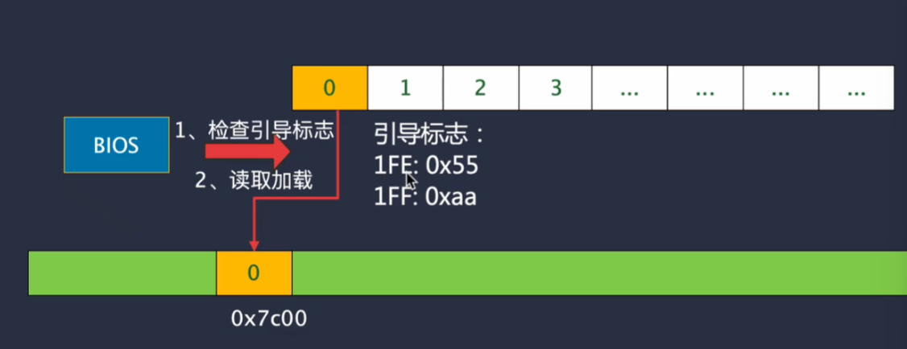
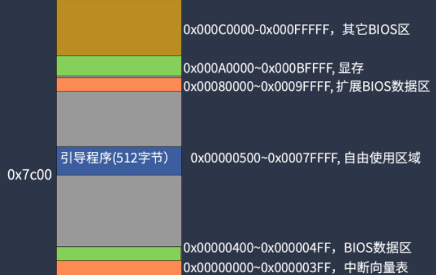
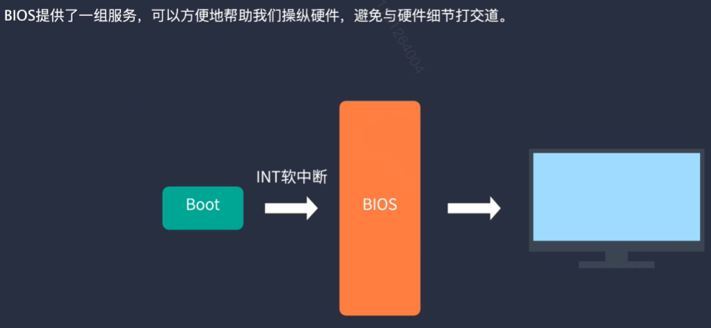
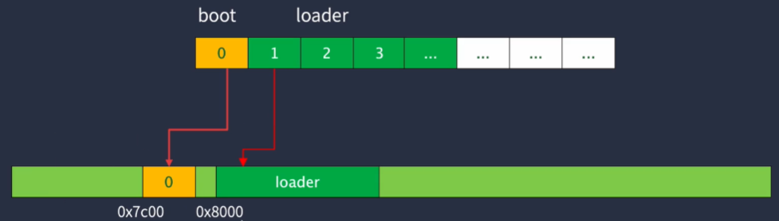
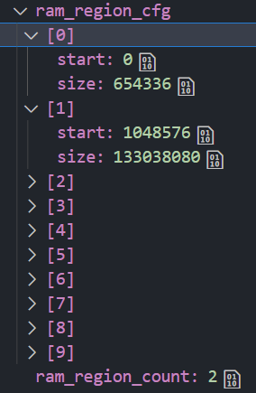

## BIOS & Loader

### 引导程序：接管控制权

启动时，BIOS会将磁盘的第0个扇区加载到0x7c00处开始运行。即只要将程序放在第0扇区，就会自动被加载到内存中。

启动时，检查第0扇区最后两个字节是否 == 0x55, 0xAA

让栈寄存器esp指向0x7c00，由于入栈是高地址往低地址，所以使用的是0x7c00下的地址。

> 实模式只支持访问1MB以内的内存，具体的内存映射如下：
>
> 
>
> 
>
> 

#### 使用 BIOS 中断显示字符

通过软中断INT指令，访问内存中中断向量表的地址处执行相应功能。

**INT 10，AH=0xE显示字符**

该BIOS中断的作用是：显示字符，同时光标前移，其中AL = 字符、BL = 前景色，BH＝页码。

具体来说，BH 为目前的显示页，如果是在图形模式，则 BH 须设为 0，假如是在图形模式下，也可以设定 BL 来表示文字的颜色，文字模式下的 BL 则无功能。至于显示页是什么，不需要了解，只需要将它设置成零即可。

#### loader 编写

BIOS 只加载磁盘的第0扇区（512字节）到内存中，因此这512字节的程序做不了太多事情。因此需要loader来完成剩下的引导。

loader放在了0x8000，这是我的设计，放在0x7c00的栈空间前也可以的。

boot启动之后，将调用BIOS中断从第1扇区加载loader到0x8000地址处，之后跳转到0x8000地址处运行。

**INT 13 磁盘读取**

BIOS提供了磁盘操作的服务中断，其具体使用方法如下：

> - AH＝02H
> - AL＝扇区数
> - CH＝柱面 cx = ch: cl
> - CL＝扇区
> - DH＝磁头
> - DL＝驱动器，00H~7FH：软盘；80H~0FFH：硬盘
> - ES:BX＝缓冲区的地址
> - 出口参数：CF＝0——操作成功，AH＝00H，AL＝传输的扇区数，否则，AH＝状态代码，参见功能号01H中的说明。CF标志见EFLAS寄存器中的CF位。

功能：在内存中划定一段区域(AL)，从磁盘中读取指定扇区的内容(CH)，加载到ES:BX内存处(这里是0x8000)。

#### loader 跳转

boot和loader分属两个工程，共生成两个bin文件。

从boot跳到loader，只知道loader的起始地址为0x8000，所以采用函数指针转换。`((void (*)(void))LOADER_START_ADDR)()` 即认为在0x8000地址处存放了这种类型的函数的代码，通过调用函数函数进入到loader中运行。

注：无论是boot还是loader，其工程均已经配置好让`start.S`中的代码位于生成的bin文件开头。所以无论是boot还是loader，其最开头的指令总是程序的入口指令。

#### ====== 阶段总结 ======

BIOS读取了硬盘第一个扇区前512字节的内容，并将这些内容放在0x7c00处。QEMU CPU将从0x7c00内存处执行指令。这个指令内容是boot，boot asm代码的功能是：

- 初始化寄存器
- 设置栈指针esp在0x7c00下面
- 用 int 0x10 BIOS中断显示了一些字符
- 用 int 0x13 BIOS中断加载了第二个扇区开始的连续0x64(32kb)的内容，放在了内存0x8000处
- 跳转至C文件中的`void boot_entry()`

`void boot_entry()`函数写了一条内容，`((void (*)(void))LOADER_START_ADDR)()`，函数指针强制转换到0x8000处执行loader的`start.S`，执行loader_16的C程序内容

### loader 实现

#### 1. 内存检测

编写一个函数`void detect_memory()`，借助BIOS中断实现以下内容：

> **第一次调用时，ES: DI存储保存读取的信息的存储位置**
>
> - 清除EBX，设置为0
> - EDX需要设置成：0x534D4150
> - EAX设置成：0xE820
> - ECX设置成：24
> - 执行INT 0x15
> - 返回结果：EAX = 0x534D4150，CF标志清0，EBX被设置成某个数值用于下次调用，CL=实际读取的字节数
>
> **后续调用：**
>
> - EDX需要设置成：0x534D4150
> - EAX重设为0xE820
> - ECX重设为24
> - 执行INT 0x15
> - 返回结果：EAX = 0x534D4150，CF标志清0。如果EBX=0，则表明读取完毕，否则当前条目有效。

将可用的内存信息，储存至结构体`boot_info`中。

可见有两块可用的内存区域，从 0~654336，1048576~133038080 (即0~640KiB左右，1MiB~128MiB不到的位置)

#### 2. 进入保护模式

CPU上电复位后进入实模式，此模式下没有任何保护机制，但提供了BIOS服务。

**保护模式特性：**

1. 只能访问1MiB内存，内和寄存器最大为16位宽
2. 所有操作数最大为16位
3. 没有任何保护机制
4. 没有特权级
5. 没有分页和虚拟内存

**实模式特性:**

1. 最大可访问内存为4GiB，寄存器位宽为32位
2. 操作数最大为32位，出入栈也为32位
3. 4种特权级，OS最高，应用程序最低
4. 支持分页和虚拟内存

