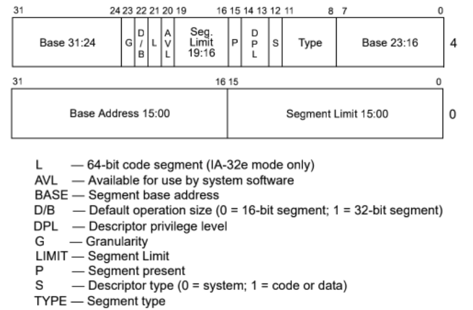
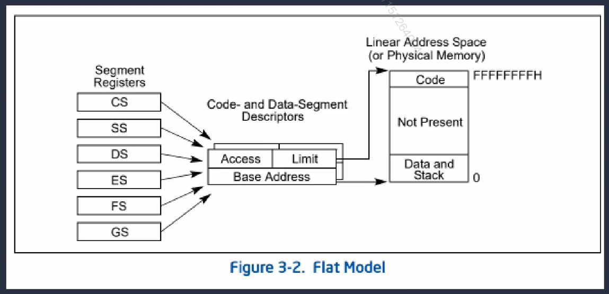

### 中断与异常处理

#### 1. 创建GDT表及其表项

进入保护模式后，所有访问内存的操作必须经过GDT表。GDT表中每项成为段描述符（Segment descriptors）。

进入内核后，首先初始化GDT表，将所有表项置为0。

#### 2. 保护模式下内存管理（概念）

 

#### 3. 重新加载 GDT

采用平坦模型：

**这里的平坦模型内存设计，GDT表就类似于RISC-V中的内核页表，需要设置GDT表的attr值的各bit位。**

使用`lgdt`指令，可以将GDT表相关的信息加载到GDTR寄存器中。后续对寄存器的访问，都会通过其指向的GDT表。

**重新加载的原因是，由于保护模式下访问内存必须通过GDT表，（CPU是通过GDTR寄存器储存的GDT地址来访问GDT表的），而之前的GDT表，存放的地址，是在loader_16.c中设置的，那个时候还没有内核，因此地址肯定是一个在0x10000（64KiB）前的地方。这段地址是废弃的，不应该继续使用。（工程中，设计是把GDT表存放在了内核的起始地址处）**