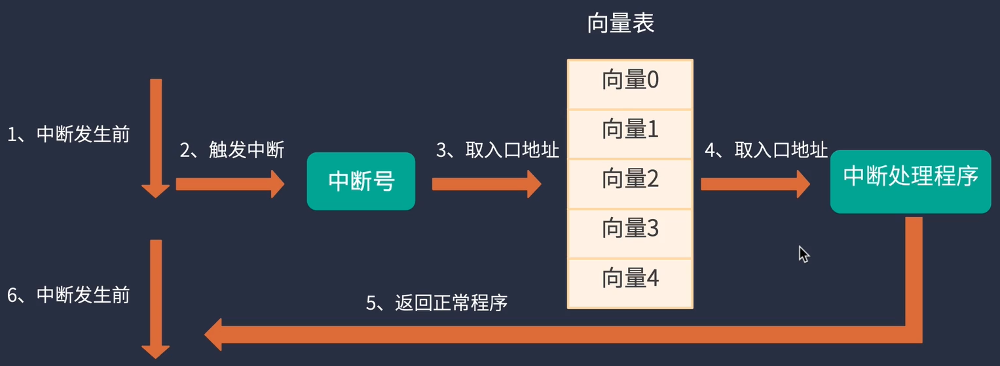
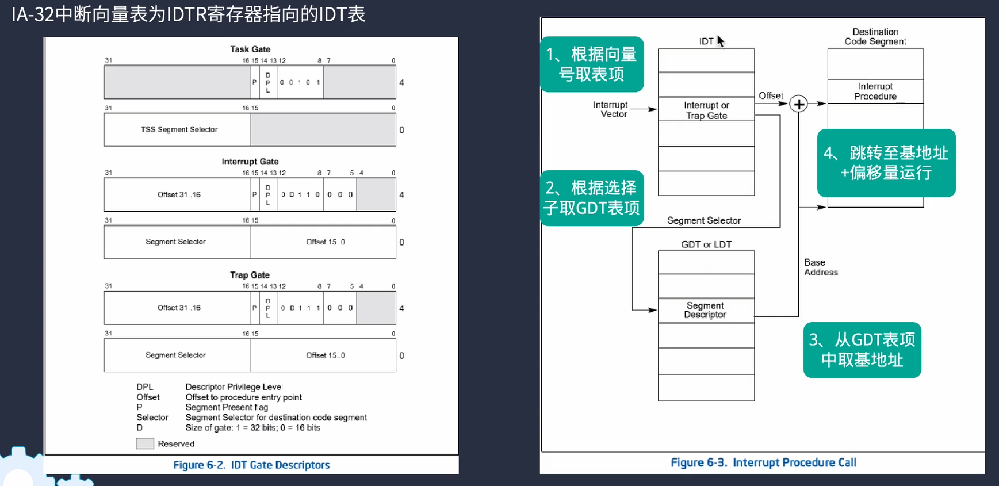
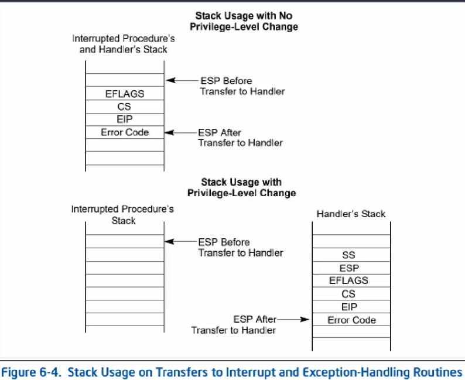
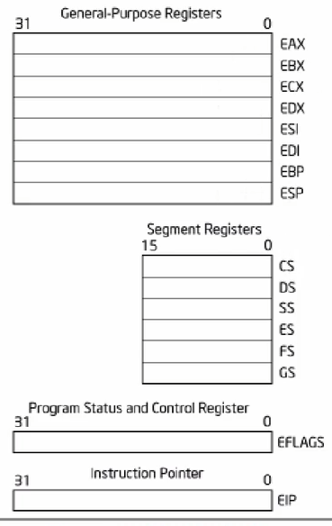
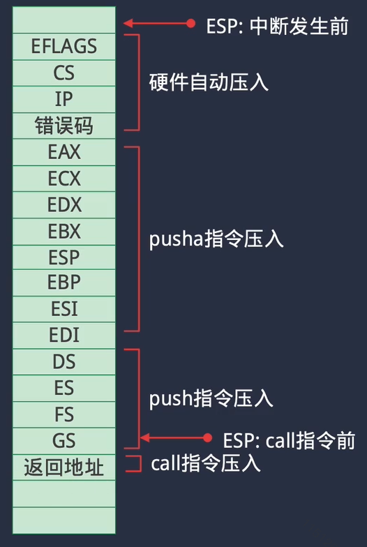
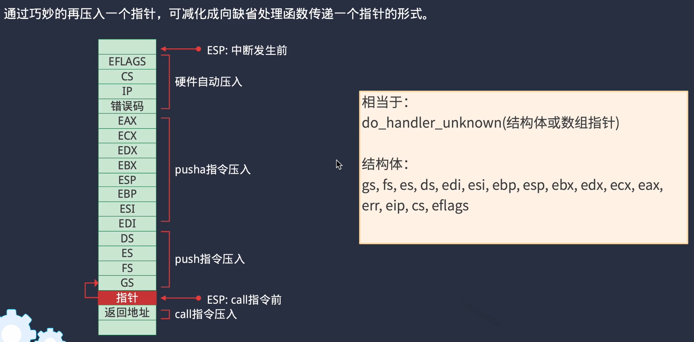

### 中断与异常处理

#### 1. 创建GDT表及其表项

进入保护模式后，所有访问内存的操作必须经过GDT表。GDT表中每项成为段描述符（Segment descriptors）。

进入内核后，首先初始化GDT表，将所有表项置为0。

#### 2. 保护模式下内存管理（概念）

 

#### 3. 重新加载 GDT

采用平坦模型：

**这里的平坦模型内存设计，GDT表就类似于RISC-V中的内核页表，需要设置GDT表的attr值的各bit位。**

使用`lgdt`指令，可以将GDT表相关的信息加载到GDTR寄存器中。后续对寄存器的访问，都会通过其指向的GDT表。

**重新加载的原因是，由于保护模式下访问内存必须通过GDT表，（CPU是通过GDTR寄存器储存的GDT地址来访问GDT表的），而之前的GDT表，存放的地址，是在loader_16.c中设置的，那个时候还没有内核，因此地址肯定是一个在0x10000（64KiB）前的地方。这段地址是废弃的，不应该继续使用。（工程中，设计是把GDT表存放在了内核的起始地址处）**

#### 4. IDT表及其初始化

需要配置中断表(interrupt descriptor table)，存放在IDTR寄存器中

在内存中放置idt表，idt表的下标就相当于是中断向量表的序号。

idt表的表项有selector，可以选择gdt表的表项，从gdt表项中取出基地址，再加上idt表中表项的offset字段即可找到中断处理程序入口。

中断处理程序入口是一个汇编函数，是因为返回指令必须是`iret`

#### 5. 现场保护

中断发生时，CPU会自动保存上图这些寄存器：EFLAGS，CS，EIP，Error Code

`pusha`指令可以保存EAX, EBX, ECX, EDX, ESI, EDI, EBP, ESP

CS，DS，SS，ES，FS，GS 不会自动保存

异常发生时，有些寄存器会记录一些信息：

EFLAGS 标志位

EIP指示了异常发生的指令地址

用结构体（一种易读易操作的方式）把这些寄存器全部保存起来

#### 6. 使用宏来构建分发处理函数

#### 7. 将exception编号挂载至IDT表

体力活

#### 8. 中断控制

##### 外部中断

古老的外部中断产生方式是由8259芯片产生，从学习角度来说，继续用这个设计

代码上来讲，是需要从代码上用`outb`写对应的端口，改写芯片的寄存器值

中断的打开和关闭，受制于两种配置：EFLAGS的标志位和8259的IMR寄存器

芯片有关的内容，太复杂。最终是完成了几个函数：

`irq_enable(int irq_num)` 开启 8259 指定序号的的中断

`irq_enable_global()` 开启全局中断

##### 时间中断

芯片是8253，CPU中断的关联端口是0x20

#### ====== 总结 ======

好像基本上都是和硬件有关内容，不太好总结，也记不住。
