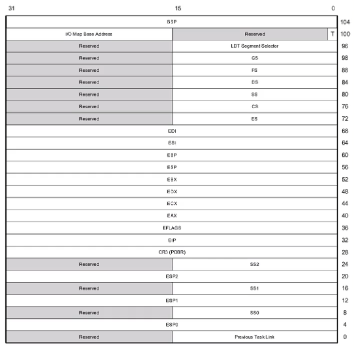
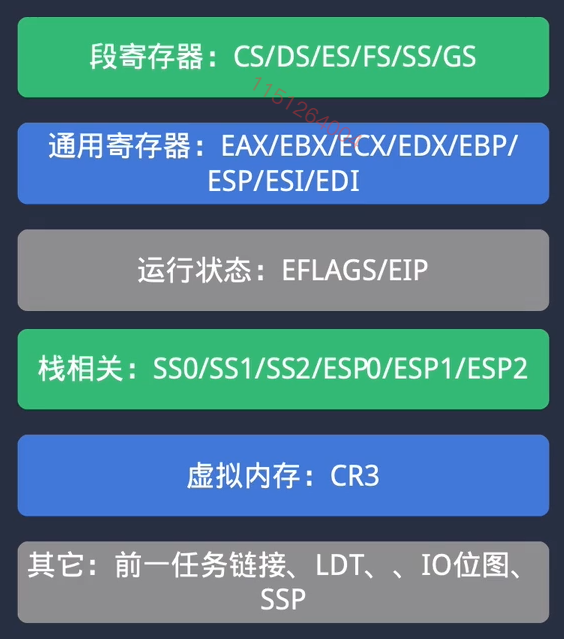
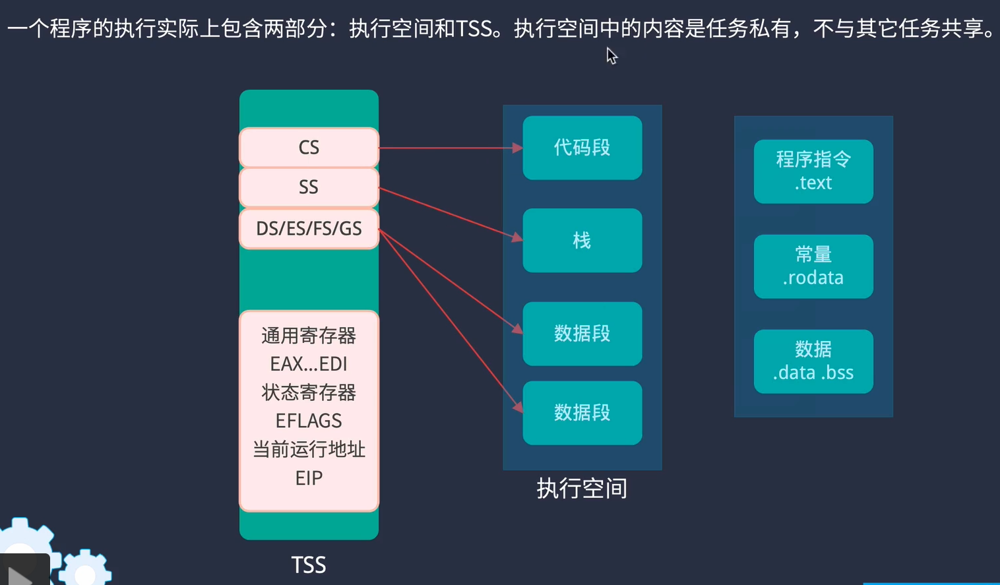
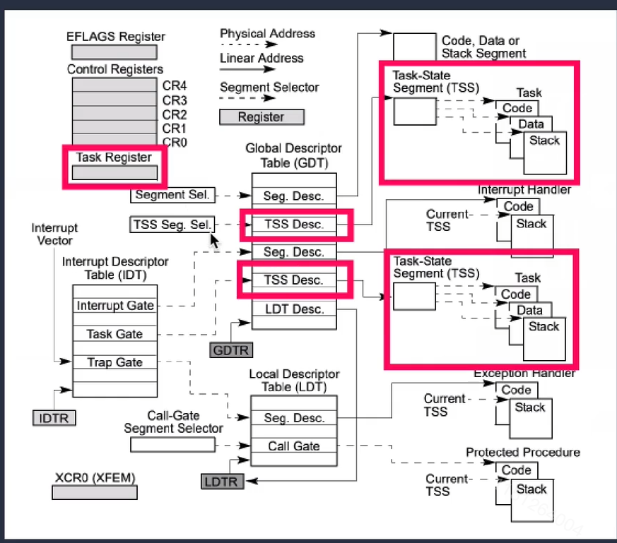
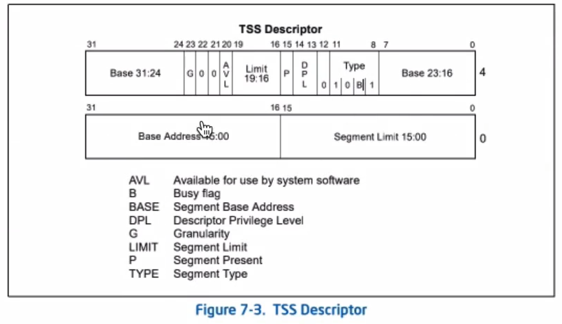
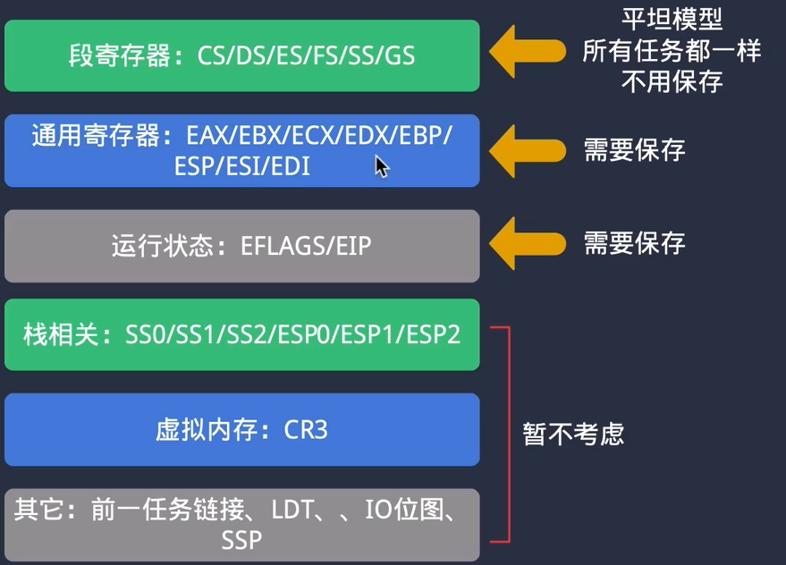
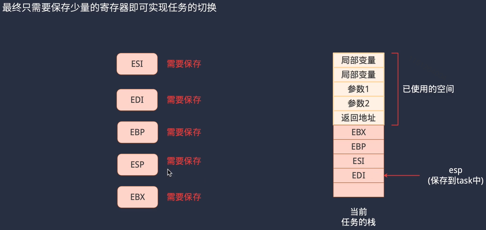

### 5 简单的进程切换

#### 1 TSS

TSS: task_state segment

ESP0~2：特权级栈

其他：寄存器

需要给每一个待运行的程序配置一个TSS结构，并设置好初始值

> 临时设计两个进程的切换：
>
> eip -> 进程地址
>
> 各个段寄存器设置成KERNEL_SELECTOR_DS，KERNEL_SELECTOR_CS
>
> esp -> 临时创建的一个栈空间(..stack[1024])
>
> exx.. 这些寄存器，由于这个函数是第一次运行，所以这些寄存器无关紧要的

有一个 任务寄存器(task register)，储存了gdt表中tss的位置。TSS描述符，位于GDT中，每个任务一个。

要进行任务切换时，使用JMP下任务的tss选择子进行切换。tss结构的恢复与保存，CPU会实现。

TSS描述符如下：

##### TSS 初始化流程

先从gdt表中找一个空闲的字段，然后取出它的地址，用变量`tss_sel`记录该地址。然后设置该地址指向task进程结构中的tss字段的地址。

##### 从初始进程开始，任务切换的逻辑

首先，每个进程都有一个数据结构表示：`task_t`。`task_t`中存放了tss数据结构和`tss_sel`选择子。

`task_init`函数用于初始化每个进程。其功能如下：

调用`tss_init`。该函数，申请一个gdt表项记录tss_sel值，初始化一个tss，分配地址空间，设置eip为新进程的入口地址，设置栈寄存器esp，设置各个段寄存器的地址。

任务切换主要调用了far_jump远跳转指令(ljmpl)，在执行该指令时，cpu会把当前寄存器的数据保存到当前（旧的）tr寄存器所指向的tss数据结构里，然后把新的tss数据复制到当前寄存器里。这些操作是通过cpu的硬件实现的

ljmpl 指向的地址是gdt表中的表项。

#### 2 上下文切换

**但是使用CPU自动的切换，多余的工作过多，因此选择手动保存**

进程上下文切换流程：

写了一个函数：`simple_switch(uint32_t** from, uint32_t* to)`

传入的参数是`&from->stack`, `to->stack`

函数内容是，保存一些寄存器后，将的from->stack改写为当前的esp，然后改写esp为to->stack的内容，然后恢复to的寄存器，上下文切换OK！

#### 3 进程队列

当进程初始化完成后，进入created状态；加入就绪队列时，进入ready状态

task_manager_t 里有两个链表：就绪态队列和普通进程队列

进程控制块里有tss字段地址，tss结构体，两个node结点：run_node和all_node，分别用作存放于就绪态队列和普通进程队列中。因为C语言不支持多态，因此用计算结构体首地址的宏来实现，通过其中的node结点，读取整个进程控制块的结构。

#### 4 CPU让度

`sys_sched_yield()` 主动让度CPU

让度时，将进程链表头部的node放入链表尾部，然后加载下一个头部的node

函数内容：取出进程队列中头部的进程，将其放入队尾，状态设置为就绪态

然后使用`task_dispatch()`获得下一个将要被选择的进程（用函数来写是为了以后可以加一下新的调度算法）

task_t 结构中指定了一个进程能运行多久的字段，

在中断代码中，定时中断到达时，`do_handler_timer`会进行进程切换

#### 5 临界资源和临界区

在使用临界资源时要划定临界区，关闭中断。

用一个state变量，记录之前中断的状态，（之前本来就是关的，进入临界区之后经历关-开，临界区离开后不能导致本来关闭的中断被打开了）

在多个进程可能同时使用的内容，要加锁

> 访问全局变量要加锁
>
> 访问log_printf要加锁
>
> 进程切换有关的函数、gdt_alloc_desc要加锁

#### 6 进程延时

设定一个延时队列，将需要延时的进程放入延时队列。

在每个时钟节拍发生时，遍历延时队列，给每一个延时队列中的进程，睡眠时间-1。判断，若延时时间减为0，则再将进程移回就绪队列尾部。

关键系统调用：`sys_sleep(uint32_t ms)`