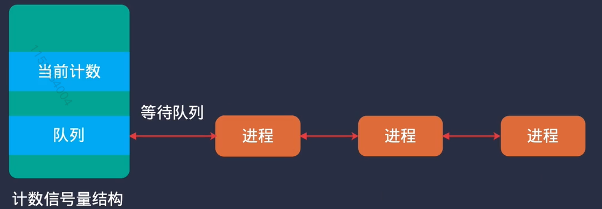

### 5 sem 信号量

#### 1 sem.h

本质上是PV操作。进程需要资源时，P操作，释放资源时，V操作

具体实现如下：

代码实现了一个信号量结构体`struct sem`，里面只有计数和等待队列。

当进程A需要等待时，使用 `sem_wait(sem_t* sem)` 来请求获得这个资源，也就是计数-1。若计数大于1，则可以直接执行。若计数为0，则把进程A加入该信号量的等待队列里(从就绪队列中移除)。

当有另外一个进程B使用 `sem_notify(sem_t* sem)` 来释放资源时，也就是企图让sem->count++，如果这时候信号量的等待队列里面有进程（比如进程A），则count不加了，直接把进程A从等待队列里释放出去(塞入就绪队列)。

sem只是表示进程之间有约定，必须要有资源时才能继续进行。sem本身是不规定进程要做什么事的。

#### 2 mutex 互斥锁

**当进程需要资源时，请求mutex锁；**

一个进程请求mutex锁时，如果此时计数为0，没有被任何进程持有（或者正在被这个进程自己持有），则将互斥锁给以这个进程(owner->curr_task)，计数+1。

如果此时mutex锁已经被其他进程持有，则把该进程放入该mutex锁的等待队列中，然后让度CPU。

**当进程释放资源时，释放mutex锁：**

如果mutex等待队列里有进程，则把队列中的第一个进程取出，放入运行队列，把互斥锁给以这个进程(owner->curr_task)，计数+1。然后执行CPU调度程序。

**相对于直接关闭中断而言，这样的互斥锁可以有很多把，（针对printf，针对gdt_alloc等），而且粒度较细。**