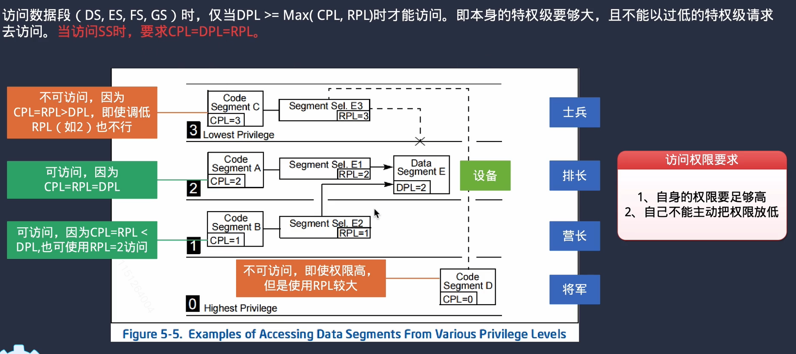
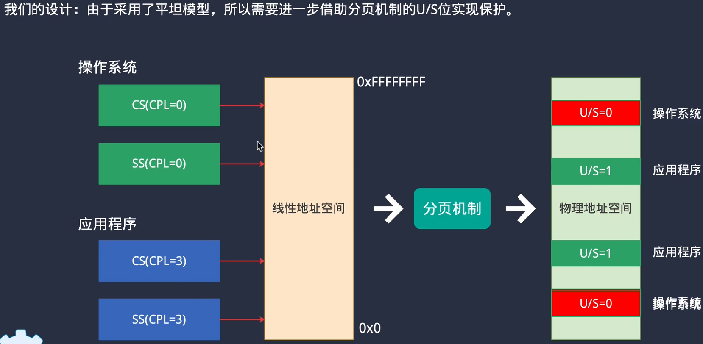
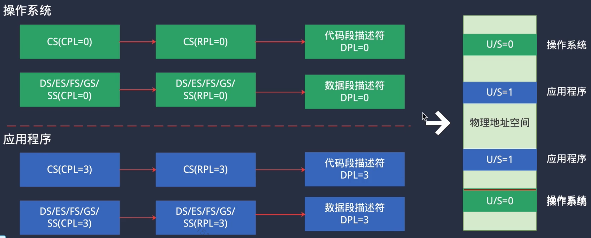

### 8 process

#### 1 进程搬运独立

因为目前没有文件系统，只能从内存中的进程来做实验

每个进程都需要设置寄存器。

项目里，采用的方式是，先把内核里自己编写的进程，代码搬到0x80000000+处，模拟一下用户进程。

具体做法是，在链接器脚本里，写好了，将 firsk_task_entry 的位置加载到物理地址的1MiB内，但是虚拟地址加载到了0x80000000+，也就是说，在调用函数read_elf时，将程序装载到内存时还是放在1MiB内的，但是这个程序的指令，全都是在0x80000000上操作的。

#### 2 特权级

x86关于权限控制的bit位好像比较复杂，CPL、DPL、RPL等，没怎么管。项目里采用的方法是操作系统的代码都是CPL = 0, 应用程序的 CPL = 3。

本项目设计：操作系统的特权级全为0，应用程序的特权级全为3。内存保护用分页机制的页表控制来做

**小总结：**CPU在执行代码时，要考虑3处的特权级：

- CS寄存器，其中有几个比特位存放了特权级标志CPL

- 段选择子，有几个bit位存放了特权级标志RPL （也就是说选择子作为下标去取GDT表项元素时，它的前3位是有其他作用的，这也解释了为什么选择子作为索引时偏移为8）

  

- GDT表项，有几个bit位存放了特权级标志DPL

  

项目在这里时，进程切换到idle进程时，OS会直接挂掉，这是因为，idle在init_task -> init_tss 时，给它设置成了特权级3，它的cs，ds段选择子的权限都是3。但是存放idle代码的页表，它的特权级是0。

#### 3 栈空间切换

触发中断时，特权级会应该发生切换，此时栈空间也应该发生切换。从用户栈到内核栈。当异常发生时，在内核栈中保存用户程序的现场？

当触发中断时，把寄存器现场保存在ss0，esp0中。（平时运行时，使用的是ss，esp）

出现异常时，错误码会写进CR2寄存器和段选择子中。

#### 4 创建进程时设置进程权限

主要是给tss_init函数中增加了一个标志位flag，当标志位为特权级0，则将tss中的CS、DS选择子设为KERNEL_CODE_SELECTOR, KERNEL_DATA_SELECTOR。否则是app_code_sel, app_data_sel

#### 5 特权级切换

主要指令是 `iret`，这个指令将图中右侧的栈里面的SS~EIP这几个内容弹出，并赋值给对应的寄存器。

#### 6 为进程创建内核栈