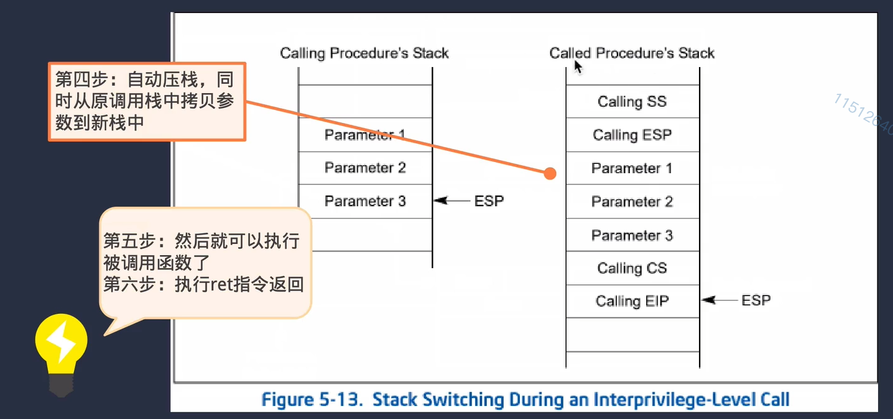
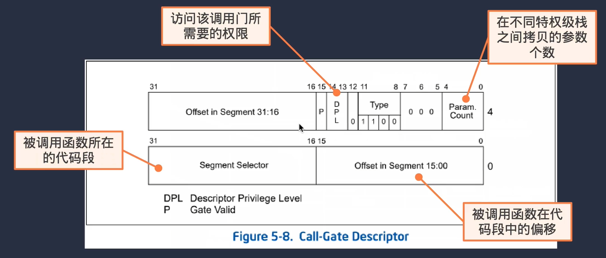
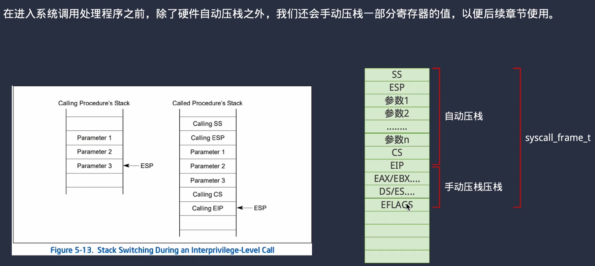
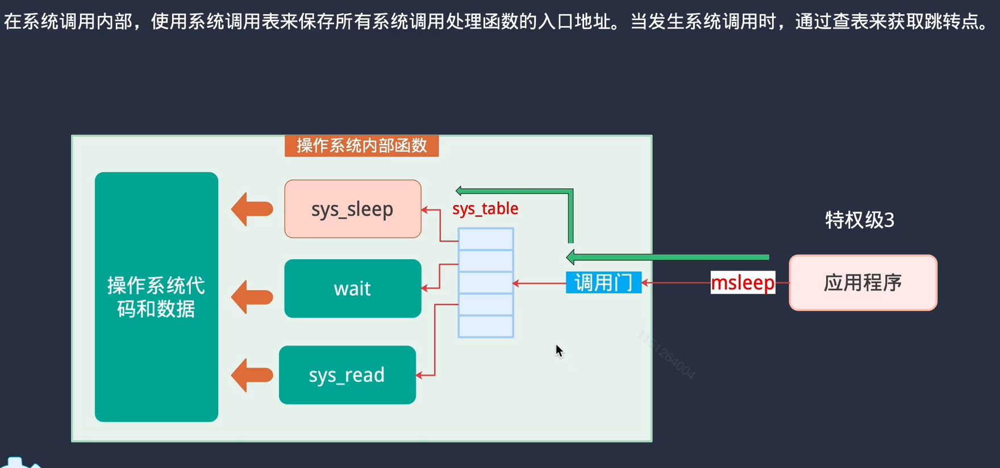

### 9 syscall

#### 1 syscall Gate 和 参数传递

`lcalll `**即为syscall调用，和中断类似，会存放SS,ESP,CS,EIP等寄存器（没有EFLAGS），而且会把用户栈的参数拷贝到内核栈里（EFLAGS）的位置**。

`lcalll` **会读取调用门里面的CS，对于系统调用来说，CS里面存放的就是KERNEL_CODE_SEG，这里面特权级的标志位是0。因此会把特权级升为0。然后读取当前进程中TSS的esp0，ss0**。

需要在GDT表里建立一个表项，表项格式与GATE门一致。表项如下：

`#define SELECTOR_SYSCALL (3 * 8)`

DPL的权限要为3，因为要保证用户态程序也能访问；

offset设置为`exception_handler_syscall`的入口地址

Segment Selector设置为`KERNEL_SELECTOR_CS`

返回时使用 `retf num`，该指令先将EIP、CS返回，然后向上跳转num个字节，然后在返回ESP、SS

#### 2 过程设计

1. 自己多加了一些寄存器，为了以后的工作可能会需要这些寄存器

2. 只使用一个调用门，然后通过这个调用门，去跳转到C函数里，分发syscall

#### ====== 自我总结 ======

要写一下调用的流程

1. 用户态程序调用封装好的msleep(int)函数

2. 项目中设定了系统调用最多支持五个参数(id, arg0~arg3)，msleep(int)会把参数封装进一个小结构体中。

3. 调用`syscall(struct syscall_args*)`，这个函数调用了lcalll。

   `lcalll`指令会保存SS、ESP、args、CS、EIP到内核栈。其中，SS、ESP、CS、EIP是CPU自动保存的，args会把当前栈的几个内容搬运到内核栈里。内核栈是从当前任务的TR寄存器里保存的TSS结构的地址找出的esp0。

4. `lcalll`的操作数是gate选择子。让它指向GDT表中SYSCALL有关的表项。这个表项里面设定了被调函数所在的代码段为KERNEL_CODE_SEG，这个代码段的权限位是0。因此跳转过去后，CPU特权级也会变成0。

5. gate选择子里设定了offset为syscall_handler的函数入口地址，从这个函数来处理系统调用。

6. 由于需要用到许多寄存器的信息，在syscall_handler汇编函数里继续保存了一堆寄存器，然后用结构体当做参数，在栈上直接传递到C语言代码里做真正的syscall分发。

7. 原路返回即可。
